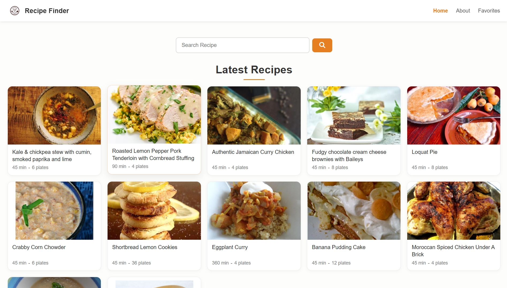

# 🍳 Recipe Finder  

A responsive **React app** to search, explore, and save recipes. Users can look up recipes by name, add/remove favorites, and enjoy a clean, mobile-friendly UI with error and empty-state handling.  
---

🔗 **Live Demo:** [Recipe Finder App](https://recipe-finder-react-api.vercel.app/)  

---

## 📸 Preview

  
*(If you see a server error, it might be due to the API request limit — just try again later.)*

---

## ✨ Features  

- 🔍 Search recipes by name  
- ❤️ Add & remove favorites (saved in localStorage)  
- 📱 Fully responsive design with mobile navigation  
- ⚠️ Error & empty state cards (server error, no results, no favorites)  
- 🚀 Deployed on **Vercel** with environment variables  

---

## 🛠️ Tech Stack  

- **React (Vite)**  
- **React Router**  
- **Context API** (error handling)  
- **CSS Modules** (scoped + responsive)  
- **LocalStorage** (favorites persistence)  
- **Vercel** (deployment)  

---

## 🚀 Getting Started  

### 1️⃣ Clone the repository  
```bash
git clone https://github.com/muddasirbutt3/Recipe-Finder.git
cd recipe-finder  
```
### 2️⃣ Install dependencies
```bash
npm install
```
### 3️⃣ Add Environment Variables

Create a .env file in the root directory and add your API key:
```bash
VITE_SPOONACULAR_KEY=your_api_key_here
VITE_SPOONACULAR_BASE_URL=your_api_url_here
```
### 4️⃣ Run locally
```bash
npm run dev
```